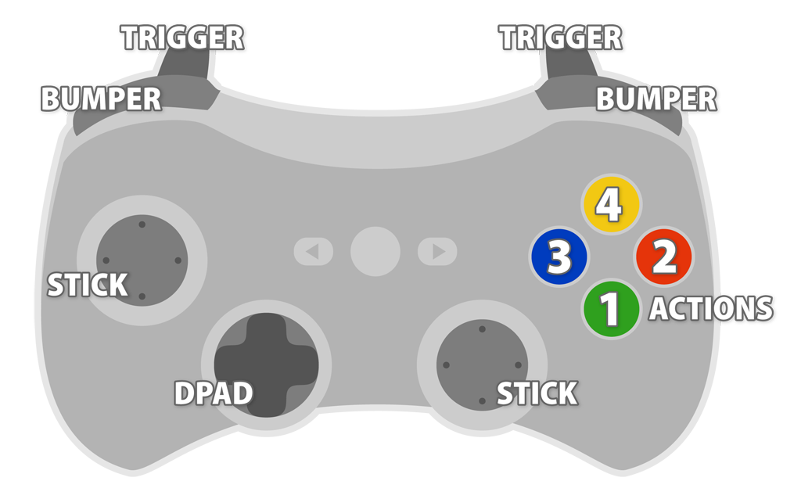

## Description

InControl is an input manager for Unity3D (version 4) that tames the cross-platform controller beast.

Note: The public API is currently in beta and is subject to change ever so slightly.

## Features

* Standardizes input mappings across various platforms.
* Unity `InputManager.asset` for 10 devices with up to 10 analogs and 20 buttons each.
* Device mappings are specified through JSON profiles that make it trivial to support new devices and platforms.
* Events for attached and detached devices.
* Events for active device switches.

## Supported Controllers

* Xbox 360 controller support for Windows, Mac and OUYA.
* Playstation 3 controller support for Windows, Mac and OUYA.
* OUYA controller support on OUYA.
* Keyboard support on Windows and Mac.

## Relevant Files

This repository contains a complete Unity application used to test the library in Windows, Mac and OUYA. As a result there are a lot of files you can safely ignore (the ODK for example). Here is the list of files to copy into your own projects:

* `Assets/InControl/*`
* `Assets/Resources/InputDeviceProfiles/*`
* `ProjectSettings/InputManager.asset`

## Standardized Inputs

Device profiles map supported controllers on various platforms to a strict set of named inputs that can be relied upon to be present. Physical positions (particularly for action buttons) will match across devices for uniformity.

* `LeftStickX, LeftStickY, LeftStickButton`
* `RightStickX, RightStickY, RightStickButton`
* `DPadUp, DPadDown, DPadLeft, DPadRight`
* `Action1, Action2, Action3, Action4`
* `LeftTrigger, RightTrigger`
* `LeftBumper, RightBumper`



**Note:** the API makes little distinction between analog and button controls, so both a `float` value and `bool` state can be queried for any input.

Unsupported devices can be used, however their default mappings are utterly unpredictable. From the API, inputs for unsupported devices will appear as `Button0` thru `Button19` and `Analog0` thru `Analog9`. Do with them what you will.

## Usage

The project is namespaced under `InControl`. The entry point is the `InputManager` class. You'll need to call `InputManager.Setup()` once and `InputManager.Update()` every tick.

```csharp
using InControl;

public class YourScene : MonoBehaviour
{
	void Start()
	{
		InputManager.Setup();
	}

	void FixedUpdate()
	{
		InputManager.Update();
		// Update all the things...
	}
}
```

Now that you have everything set up, you can query for devices and controls. The active device is the device that last received input.

```csharp
InputDevice device = InputManager.ActiveDevice;
InputControl control = device.GetControl( InputControlType.Action1 )
```

Query an indexed device like so:

```csharp
var player1 = InputManager.Devices[0];
```

Given a control, there are several properties to query:

```csharp
control.HasChanged;  // bool, state has changed since previous tick
control.WasPressed;  // bool, pressed since previous tick
control.WasReleased; // bool, released since previous tick
control.State;       // bool, is currently pressed
control.Value;       // float, in range -1..1 for axes, 0..1 for buttons
control.LastState;   // bool, previous tick state
control.LastValue;   // float, previous tick value
```

Controls also implement implicit conversion operators for `bool` and `float` which allows for slightly simpler syntax:

```csharp
if (InputManager.ActiveDevice.GetControl( InputControlType.Action1 ))
{
	player.Jump();
}
```

Finally, you can subscribe to events to detect when the active device changed, or devices are attached/detached:

```csharp
InputManager.OnDeviceAttached += inputDevice => Debug.Log( "Attached: " + inputDevice.Name );
InputManager.OnDeviceDetached += inputDevice => Debug.Log( "Detached: " + inputDevice.Name );
InputManager.OnActiveDeviceChanged += inputDevice => Debug.Log( "Switched: " + inputDevice.Name );
```

## To-do List

* API to record and play back device input (for replays!)
* API to enable non-Unity devices and virtual controls as first-class citizens.
* API to assist with allowing users to customize device inputs for game actions.
* Support Apple MFi controllers on Mac and iOS.
* Add popular Android controllers, like the Moga Pro.
* Linux support?

## Known Issues

* Not all platforms trigger the `DeviceAttached` event (OUYA in particular). If Unity's `Input.joystickNames()` is updated by the platform while the app is running, it will work. Every platform does, however, report all newly connected devices once the app is relaunched.
* Some controller specific buttons (like Start, Select, Back, OUYA, Xbox Guide, PS3, etc.) are not part of the standardized set of supported inputs simply because they do not work on every platform. You should not generally be using these buttons anyway. Use of the OUYA button, for example, is dangerous as the user is just as likely to quit your app do what they intend.

## Dependencies

This project requires [TinyJSON](pbhogan/TinyJSON). It is included in this project under `Assets/InControl/ThirdParty`.

## Meta

Handcrafted by Patrick Hogan [[twitter](http://twitter.com/pbhogan) &bull; [github](http://github.com/pbhogan) &bull; [website](http://www.gallantgames.com)]

If this project makes you happy, you can support it with Gittip:
<iframe style="border: 0; margin: 0; padding: 0;" src="https://www.gittip.com/pbhogan/widget.html" width="48pt" height="22pt"></iframe>

Released under the [MIT License](http://www.opensource.org/licenses/mit-license.php).
